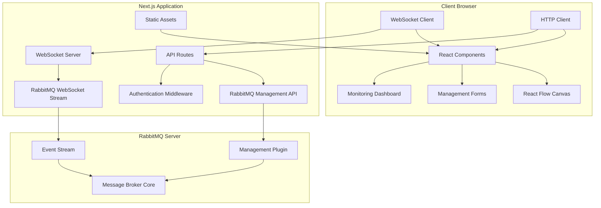

# Design Document

## Overview

The RabbitMQ Service Management App is a full-stack web application built with Next.js that provides comprehensive visualization and management capabilities for RabbitMQ message broker systems. The application leverages React Flow for interactive topology diagrams, WebSocket connections for real-time updates, and the RabbitMQ Management API for operational control.

### Key Design Principles

- **Real-time First**: All visualizations and data updates happen in real-time using WebSocket connections
- **Component-based Architecture**: Modular React components for reusability and maintainability  
- **API-driven**: All RabbitMQ interactions go through Next.js API routes for security and consistency
- **Responsive Design**: Mobile-friendly interface using Tailwind CSS
- **Type Safety**: Full TypeScript implementation for reliability

## Architecture

### System Architecture



### Technology Stack

- **Frontend**: React 19, Next.js 15, TypeScript, Tailwind CSS
- **Visualization**: React Flow, Lucide React icons
- **Real-time**: Socket.IO for WebSocket communication
- **State Management**: Zustand for global state
- **HTTP Client**: Axios for API requests
- **Charts**: Chart.js for metrics visualization
- **Authentication**: NextAuth.js with JWT
- **Testing**: Jest, React Testing Library, Playwright

## Components and Interfaces

### Core Components

#### 1. Topology Canvas (`components/topology/TopologyCanvas.tsx`)
```typescript
interface TopologyCanvasProps {
  nodes: TopologyNode[]
  edges: TopologyEdge[]
  onNodeAdd: (type: NodeType, position: Position) => void
  onNodeDelete: (nodeId: string) => void
  onEdgeAdd: (source: string, target: string) => void
  onEdgeDelete: (edgeId: string) => void
}
```

#### 2. Node Types
```typescript
// Base node interface
interface TopologyNode {
  id: string
  type: 'producer' | 'exchange' | 'queue' | 'consumer'
  position: { x: number; y: number }
  data: NodeData
}

// Exchange node data
interface ExchangeNodeData extends NodeData {
  exchangeType: 'direct' | 'fanout' | 'topic' | 'headers'
  durable: boolean
  autoDelete: boolean
  arguments: Record<string, any>
}

// Queue node data  
interface QueueNodeData extends NodeData {
  durable: boolean
  exclusive: boolean
  autoDelete: boolean
  ttl?: number
  maxLength?: number
  deadLetterExchange?: string
}
```

#### 3. Message Animation System (`components/animation/MessageFlow.tsx`)
```typescript
interface MessageFlowProps {
  messages: ActiveMessage[]
  edges: TopologyEdge[]
  onMessageComplete: (messageId: string) => void
}

interface ActiveMessage {
  id: string
  sourceNodeId: string
  targetNodeId: string
  status: 'published' | 'routed' | 'consumed' | 'acknowledged' | 'dead-lettered'
  payload: any
  routingKey: string
  timestamp: number
}
```

#### 4. Management Forms (`components/management/`)
- `ExchangeForm.tsx` - Create/edit exchanges
- `QueueForm.tsx` - Create/edit queues  
- `BindingForm.tsx` - Create/edit bindings
- `MessagePublisher.tsx` - Publish test messages
- `ConsumerSimulator.tsx` - Virtual consumer management

#### 5. Monitoring Dashboard (`components/monitoring/Dashboard.tsx`)
```typescript
interface DashboardProps {
  metrics: RabbitMQMetrics
  alerts: Alert[]
  onThresholdUpdate: (metric: string, threshold: number) => void
}

interface RabbitMQMetrics {
  queues: QueueMetrics[]
  exchanges: ExchangeMetrics[]
  connections: ConnectionMetrics[]
  overview: OverviewMetrics
}
```

### API Routes Structure

#### RabbitMQ Management API Routes (`pages/api/rabbitmq/`)
- `GET /api/rabbitmq/overview` - System overview and stats
- `GET /api/rabbitmq/exchanges` - List all exchanges
- `POST /api/rabbitmq/exchanges` - Create exchange
- `DELETE /api/rabbitmq/exchanges/[name]` - Delete exchange
- `GET /api/rabbitmq/queues` - List all queues
- `POST /api/rabbitmq/queues` - Create queue
- `DELETE /api/rabbitmq/queues/[name]` - Delete queue
- `GET /api/rabbitmq/bindings` - List all bindings
- `POST /api/rabbitmq/bindings` - Create binding
- `POST /api/rabbitmq/publish` - Publish message
- `GET /api/rabbitmq/messages/[queue]` - Get messages from queue

#### WebSocket Events (`pages/api/socket.ts`)
```typescript
// Client -> Server events
interface ClientToServerEvents {
  'subscribe-topology': () => void
  'subscribe-messages': (queueNames: string[]) => void
  'publish-message': (message: PublishMessageData) => void
}

// Server -> Client events  
interface ServerToClientEvents {
  'topology-update': (topology: TopologyData) => void
  'message-published': (message: MessageEvent) => void
  'message-consumed': (message: MessageEvent) => void
  'message-acknowledged': (message: MessageEvent) => void
  'metrics-update': (metrics: RabbitMQMetrics) => void
}
```

## Data Models

### Core Data Models

#### 1. Topology Models
```typescript
interface TopologyData {
  exchanges: Exchange[]
  queues: Queue[]
  bindings: Binding[]
  connections: Connection[]
}

interface Exchange {
  name: string
  type: 'direct' | 'fanout' | 'topic' | 'headers'
  durable: boolean
  auto_delete: boolean
  internal: boolean
  arguments: Record<string, any>
}

interface Queue {
  name: string
  durable: boolean
  exclusive: boolean
  auto_delete: boolean
  arguments: Record<string, any>
  node: string
  state: 'running' | 'idle'
  consumers: number
  messages: number
}

interface Binding {
  source: string
  destination: string
  destination_type: 'queue' | 'exchange'
  routing_key: string
  arguments: Record<string, any>
}
```

#### 2. Message Models
```typescript
interface Message {
  payload: string | object
  properties: MessageProperties
  routing_key: string
  exchange: string
  redelivered: boolean
}

interface MessageProperties {
  content_type?: string
  content_encoding?: string
  headers?: Record<string, any>
  delivery_mode?: number
  priority?: number
  correlation_id?: string
  reply_to?: string
  expiration?: string
  message_id?: string
  timestamp?: number
  type?: string
  user_id?: string
  app_id?: string
}
```

#### 3. Metrics Models
```typescript
interface QueueMetrics {
  name: string
  messages: number
  messages_ready: number
  messages_unacknowledged: number
  consumers: number
  message_stats: {
    publish: number
    publish_details: { rate: number }
    deliver_get: number
    deliver_get_details: { rate: number }
  }
}

interface OverviewMetrics {
  message_stats: {
    publish: number
    publish_details: { rate: number }
    deliver_get: number
    deliver_get_details: { rate: number }
  }
  queue_totals: {
    messages: number
    messages_ready: number
    messages_unacknowledged: number
  }
  object_totals: {
    connections: number
    channels: number
    exchanges: number
    queues: number
    consumers: number
  }
}
```

## Error Handling

### API Error Handling Strategy

#### 1. RabbitMQ API Errors
```typescript
class RabbitMQApiError extends Error {
  constructor(
    public statusCode: number,
    public rabbitMQError: string,
    message: string
  ) {
    super(message)
    this.name = 'RabbitMQApiError'
  }
}

// Error handling middleware
export function handleRabbitMQError(error: any): NextApiResponse {
  if (error.response?.status === 404) {
    return { status: 404, message: 'Resource not found' }
  }
  if (error.response?.status === 401) {
    return { status: 401, message: 'Authentication failed' }
  }
  return { status: 500, message: 'Internal server error' }
}
```

#### 2. WebSocket Error Handling
```typescript
// Connection resilience
class WebSocketManager {
  private reconnectAttempts = 0
  private maxReconnectAttempts = 5
  private reconnectDelay = 1000

  handleDisconnect() {
    if (this.reconnectAttempts < this.maxReconnectAttempts) {
      setTimeout(() => {
        this.reconnectAttempts++
        this.connect()
      }, this.reconnectDelay * this.reconnectAttempts)
    }
  }

  handleError(error: Error) {
    console.error('WebSocket error:', error)
    this.emit('connection-error', error)
  }
}
```

#### 3. Frontend Error Boundaries
```typescript
class TopologyErrorBoundary extends React.Component {
  state = { hasError: false, error: null }

  static getDerivedStateFromError(error: Error) {
    return { hasError: true, error }
  }

  componentDidCatch(error: Error, errorInfo: React.ErrorInfo) {
    console.error('Topology error:', error, errorInfo)
    // Send to error reporting service
  }

  render() {
    if (this.state.hasError) {
      return <ErrorFallback error={this.state.error} />
    }
    return this.props.children
  }
}
```

## Testing Strategy

### Unit Testing
- **Components**: Test React components with React Testing Library
- **API Routes**: Test Next.js API routes with Jest and supertest
- **Utilities**: Test helper functions and data transformations
- **State Management**: Test Zustand stores and actions

### Integration Testing
- **API Integration**: Test RabbitMQ Management API integration
- **WebSocket Integration**: Test real-time message flow
- **Database Integration**: Test configuration persistence

### End-to-End Testing
- **User Workflows**: Test complete user journeys with Playwright
- **Cross-browser Testing**: Ensure compatibility across browsers
- **Performance Testing**: Test with large topologies and high message volumes

### Testing Configuration
```typescript
// jest.config.js
module.exports = {
  testEnvironment: 'jsdom',
  setupFilesAfterEnv: ['<rootDir>/jest.setup.js'],
  moduleNameMapping: {
    '^@/(.*)$': '<rootDir>/$1',
  },
  collectCoverageFrom: [
    'components/**/*.{ts,tsx}',
    'pages/**/*.{ts,tsx}',
    'lib/**/*.{ts,tsx}',
    '!**/*.d.ts',
  ],
}

// playwright.config.ts
export default defineConfig({
  testDir: './e2e',
  fullyParallel: true,
  forbidOnly: !!process.env.CI,
  retries: process.env.CI ? 2 : 0,
  workers: process.env.CI ? 1 : undefined,
  reporter: 'html',
  use: {
    baseURL: 'http://localhost:3000',
    trace: 'on-first-retry',
  },
  projects: [
    { name: 'chromium', use: { ...devices['Desktop Chrome'] } },
    { name: 'firefox', use: { ...devices['Desktop Firefox'] } },
    { name: 'webkit', use: { ...devices['Desktop Safari'] } },
  ],
})
```

### Performance Considerations

#### 1. React Flow Optimization
- Implement node virtualization for large topologies (>100 nodes)
- Use React.memo for node components to prevent unnecessary re-renders
- Debounce position updates during drag operations
- Implement lazy loading for node details

#### 2. WebSocket Optimization  
- Implement message batching to reduce WebSocket traffic
- Use compression for large message payloads
- Implement client-side message filtering
- Add connection pooling for multiple RabbitMQ instances

#### 3. State Management Optimization
- Use Zustand slices to prevent unnecessary component updates
- Implement selective subscriptions for large datasets
- Cache frequently accessed data with TTL
- Use React Query for server state management

### Security Considerations

#### 1. Authentication & Authorization
- Implement JWT-based authentication with refresh tokens
- Use role-based access control (RBAC) for feature access
- Secure API routes with middleware validation
- Implement session management with secure cookies

#### 2. API Security
- Validate all inputs with Zod schemas
- Implement rate limiting for API endpoints
- Use CORS configuration for cross-origin requests
- Sanitize user inputs to prevent XSS attacks

#### 3. RabbitMQ Security
- Proxy all RabbitMQ API calls through Next.js backend
- Store RabbitMQ credentials securely in environment variables
- Implement connection pooling with authentication
- Use TLS for RabbitMQ connections in production